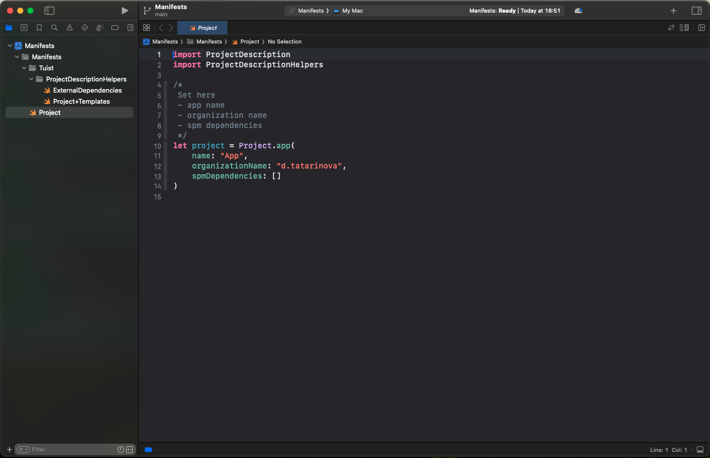
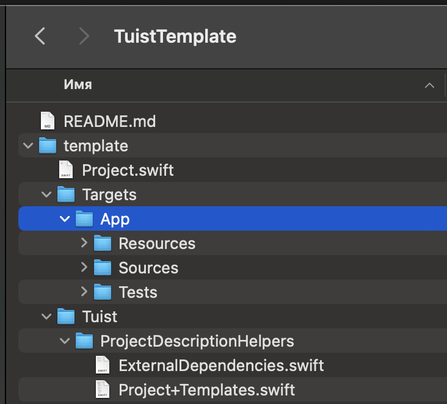

# TuistTemplate

# Getting started

Install [tuist](https://tuist.io) if it is not installed.

After tuist is installed:

1. Clone repository

```bash
git clone https://github.com/tatarinova0903/TuistTemplate.git
```

2. Go to template directory

```bash
cd template
```

3. Open tuist project

```bash
tuist edit
```

4. In opened tuist project go to Project.swift file



5. Set your own app name and organization name

**Be careful**: app name should be equal to directory name with code of your iOS app 



6. Generate iOS app project

```bash
tuist generate
```

# Adding SPM dependencies

If you need to add SPM dependencies to you project you can:

1. Open tuist project

```bash
tuist edit
```

2. Go to ExternalDependencies.swift file

3. Add you dependency like this

```swift
static let kingfisher = SPMDependency(
    url: "https://github.com/onevcat/Kingfisher",
    name: "Kingfisher",
    requirement: .exact("7.11.0")
)
```

4. Add dependency to your project by going to Project.swift file and adding `.kingfisher`

```swift
let project = Project.app(
    name: "App",
    organizationName: "d.tatarinova",
    spmDependencies: [.kingfisher]
)
```

5. Generate iOS app project

```bash
tuist generate
```
